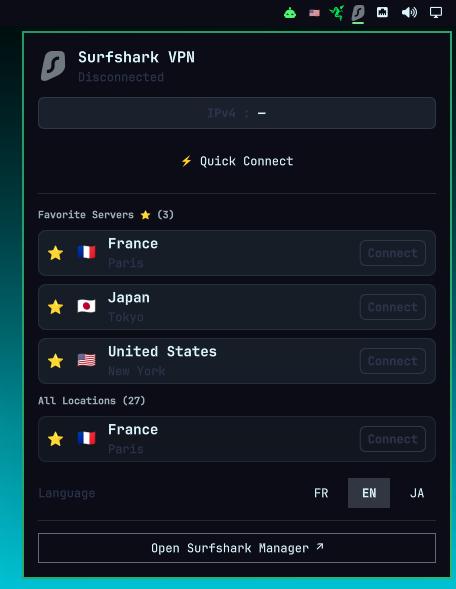
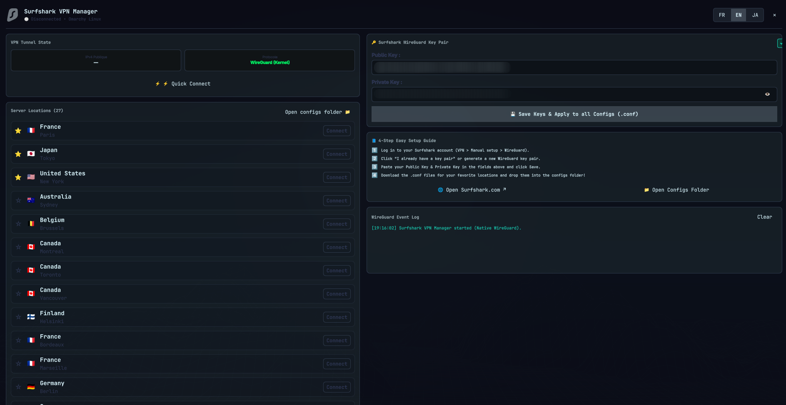

# 🦈 Surfshark VPN for Omarchy Linux

[](https://github.com/djkawada/omarchy-surfshark-plugin)
[](https://www.rust-lang.org/)
[](https://www.wireguard.com/)
[](LICENSE)

An **ultra-lightweight, zero-bloat, native WireGuard VPN manager and status monitor** for Surfshark users on Omarchy Linux (Hyprland / Quickshell).

---

## 📸 Screenshots

<div align="center">
  <h3>Status Bar Widget & Quick Connect Panel</h3>
  
  <br/><br/>
  <h3>Surfshark Manager (Settings, WireGuard Key Injection & Diagnostics)</h3>
  
</div>

---

## 🎯 Why This Plugin?

The official Surfshark Electron client is resource-heavy (~300 MB RAM), prone to tray icon bugs on Wayland, and introduces unnecessary background daemon overhead.

**Surfshark VPN for Omarchy** delivers:
- **⚡ Instant Connection (< 150ms)**: Powered by standard Linux kernel WireGuard integration (`NetworkManager` / `nmcli`).
- **🦀 Native Rust Engine (`surfshark-ctl`)**: High-performance, zero memory footprint, multithreaded non-blocking status queries.
- **🌐 Dual-Stack Public IP Monitor**: Real-time display of both your public **IPv4** and **IPv6** addresses.
- **🔑 In-App WireGuard Key Manager**: Enter your Surfshark WireGuard Public & Private keys directly in the GUI — they are securely saved (`0600`) and automatically applied to all `.conf` profiles!
- **⭐ Favorite Servers & Location Switcher**: Star your favorite countries (France 🇫🇷, Japan 🇯🇵, USA 🇺🇸, Germany 🇩🇪, etc.) for instant one-click switching.
- **🌍 Tri-Lingual Localization**: Instant real-time UI switching between **Français 🇫🇷**, **English 🇬🇧**, and **日本語 🇯🇵**.
- **🛡️ Clean Connection Lifecycle**: Automatic teardown of stale routes, zero zombie interfaces, and conflict-free NetworkManager profile management.

---

## 🚀 Installation

### Option 1: Via Omarchy Plugin Manager (Recommended)
```bash
omarchy plugin add https://github.com/djkawada/omarchy-surfshark-plugin.git
```

### Option 2: Manual Git Clone
```bash
git clone https://github.com/djkawada/omarchy-surfshark-plugin.git ~/.config/omarchy/plugins/com.github.djkawada.surfshark-vpn
```

### Enable in Your Status Bar
In `~/.config/omarchy/shell.json`, add `"com.github.djkawada.surfshark-vpn"` to your `bar.layout.right` section:

```json
{
  "bar": {
    "layout": {
      "right": [
        "com.github.djkawada.surfshark-vpn",
        "omarchy.network",
        "omarchy.battery",
        "omarchy.clock"
      ]
    }
  }
}
```

Then restart the shell:
```bash
omarchy restart shell
```

---

## ⚙️ Easy 4-Step Setup Guide

1. **Open Surfshark WireGuard Portal**:
   Log in to your account at [my.surfshark.com > VPN > Manual setup > WireGuard](https://my.surfshark.com/vpn/manual-setup/main/wireguard).
2. **Generate or Retrieve Your Key Pair**:
   Click *“I already have a key pair”* or generate a new key pair.
3. **Save Keys in Surfshark Manager**:
   Open **Surfshark Manager ↗** from the bar widget, paste your **Public Key** and **Private Key**, then click **💾 Enregistrer les Clés & Appliquer**.
4. **Download Location Profiles**:
   Download the `.conf` files for your preferred server locations (e.g. `fr-par.conf`, `jp-tok.conf`, `us-nyc.conf`) and drop them into:
   ```bash
   ~/.config/surfshark-vpn/configs/
   ```
   *(Or click **📁 Ouvrir Dossier Configs** directly in the manager).*

---

## 🏗️ Architecture & Tech Stack

```
┌─────────────────────────────────────────────────────────────┐
│                       OMARCHY SHELL                         │
│   BarWidget.qml                SurfsharkControlCenter.qml   │
│   (Status Bar Slot & Popup)    (Settings & Key Injection)   │
└──────────────────────────────┬──────────────────────────────┘
                               │
               systemd-run --user --pipe
                               │
┌──────────────────────────────▼──────────────────────────────┐
│                    surfshark-vpn.sh / Rust                  │
│       Native NetworkManager / WireGuard Execution Scope     │
└──────────────────────────────┬──────────────────────────────┘
                               │
┌──────────────────────────────▼──────────────────────────────┐
│                    LINUX KERNEL WIREGUARD                   │
│   Ultra-fast UDP Crypto Tunnel (ChaCha20 / Poly1305)       │
└─────────────────────────────────────────────────────────────┘
```

- **UI Layer**: [Quickshell](https://quickshell.outfoxxed.me/) / Qt 6 QML (`qs.Ui`, `qs.Commons`).
- **Core Controller**: Native compiled Rust binary (`surfshark-ctl`) with standalone POSIX bash wrapper (`surfshark-vpn.sh`).
- **Network Engine**: Linux Kernel WireGuard via `nmcli`.

---

## 🔄 Updates & Removal

### Update
```bash
omarchy plugin update com.github.djkawada.surfshark-vpn
# Or if installed via git:
cd ~/.config/omarchy/plugins/com.github.djkawada.surfshark-vpn && git pull && omarchy restart shell
```

### Remove / Uninstall
```bash
omarchy plugin remove com.github.djkawada.surfshark-vpn
# Or manual:
rm -rf ~/.config/omarchy/plugins/com.github.djkawada.surfshark-vpn
omarchy restart shell
```

---

## 📄 License

Distributed under the **MIT License**. Created by [Pierre (Djkawada)](https://github.com/Djkawada).
